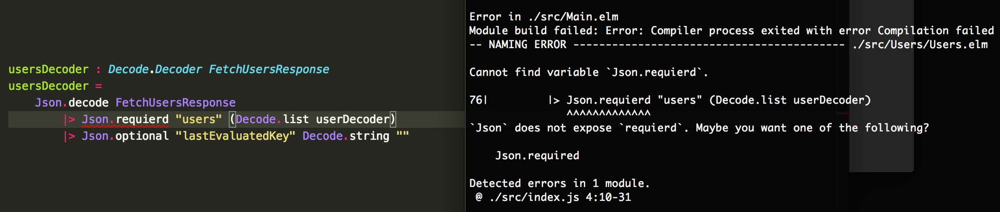
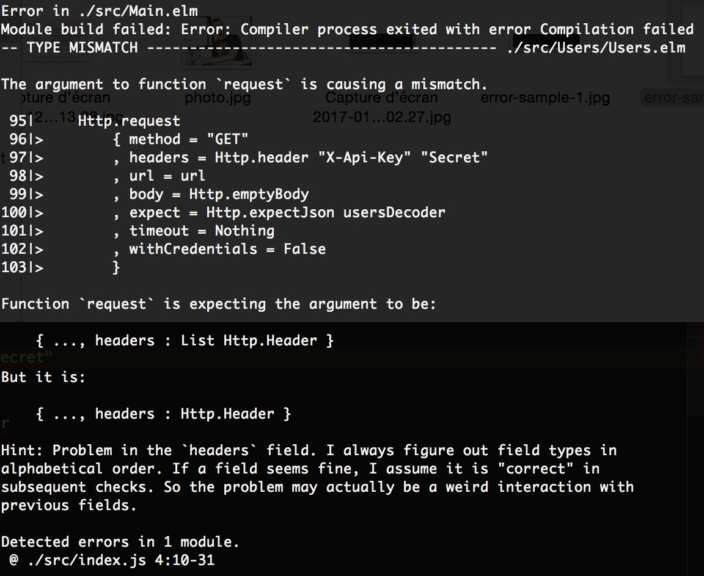

As many of us, I started building my first websites many years ago, using Dreamweaver and a range of shiny background colors. Ugly background colors. But for me it was undoubtedly the best websites ever!

Soon, I wanted to add more interactivity: popup, embedded chat widget, hover effects on images... This was my first discovery of JavaScript, a happy new wonderful world! Except it was not. It was awful. I didn't quite understood what I was doing, copying and pasting some code samples, happy when it worked but unable to fix it when it didn't. Damn, I was bad!

<!-- more -->

It's only a few years later, after learning other languages that I came back to JavaScript with the rising of jQuery. It was now so easy to do JavaScript! Just install the proper plugin and call it on a DOM element! Damn, I was still bad! But at least I didn't know...

Afterwards during an internship, I started learning Node.js and some front-end framework, beginning to really learn about JavaScript itself, understanding how deeply I was a fool before. There is beauty in this language, even if [there is also some atrocity](https://dorey.github.io/JavaScript-Equality-Table/).

And I began to feel really good at it. I used Lodash to provide the features the language missed and recently abandoned it in favor of ES6 that brought everything I was dreaming for. I was then working on a really great project in AngularJS. The project started simple and grew in complexity over time, adding more and more use cases. That was good. Good because these use cases were really needed by the business. It really brought them a significant value.

As a developer though, it meant rewriting again and again, trying to make the codebase fit the users needs. We ended up – on a really specific page – transmitting values across many directives with double data-binding. And amongst all those directives, some did update the values. For examples, a date value was dispatched between a date picker, an input field and a directive used to link dates between them. The date picker and the input field were returning a string date and the directive a [`moment`](http://momentjs.com/) object. Sometimes, it was also a Date object. Not knowing which did update the date, we couldn't know the type of the data we've just received, and the developer just conveniently passed it to the `moment` constructor to get a `moment` object:

```js
// What the f**k is $scope.date?
$scope.date;
// Oh... nevermind!
$scope.date = moment($scope.date);

/* Some nice warning into the console:
 *
 * Deprecation warning: value provided is not in a recognized
 * ISO format. moment construction falls back to js Date(),
 * which is not reliable across all browsers and versions.
 * Non ISO date formats are discouraged and will be removed
 * in an upcoming major release. Please refer to
 * http://momentjs.com/guides/#/warnings/js-date/ for more info.
 */
```

You don't need to tell me that this is wrong at so many levels. And that this could have been avoided by being more strict with date format handling. I know. I *am* ashamed. The point is we know there can be problems with the types of our variables. Maybe not with dates, maybe someone just added one field to an entity and forgot to add it everywhere. Maybe there is some JSON data that is serialized into the database and you don't know at some point if it has already been parsed.

In a way, I have thought I could give static types a try and went for TypeScript. It has been quite hard to setup, more because of the project context than because of the technology itself. Once working, I have begun to notice some real improvements in my development workflow. Declaring types and interfaces made me think more about my design. Static analysis in my IDE helped me prevent mistakes before they even occurred. Intellisense was far more reliable and I didn't need anymore to check some objects definitions before using them. Despite I had to declare my structures and types, I gained a lot of time because of theses reasons.

Along the years, another fact was bothering me. A significant part of the bugs I was fixing in JavaScript was related to `null` or `undefined` values.

```diff
Uncaught TypeError: Cannot read property 'filter' of null(…)

Uncaught TypeError: undefined is not a function(…)
```

I came to think that `null`/`undefined` were in a way the worst thing that have been added to JavaScript. And TypeScript didn't help me about that, because before the v2.1, there was no way to enforce dealing with those values. Not handling `null` and `undefined` values was the kind of mistakes I met the most. I let you with this food for thought, but right now let's come back to my issues about dates.

Another problem was that we were not able to know exactly where and why a date was changed. That lead me to think more about my data flow. That was the time I was discovering functional programming. I began using a style more and more functional, enforcing more immutability, even without using specific libraries for that. It was good for my codebase. Changes were more obvious. More readable.

I tried to reduce side effects into my codebase, avoiding as much as possible the AngularJS 2-way data-binding, trying to centralize data and changes. I'd like to tell you that it made my life perfect and that all my issues were off for good. But I'm not a really good liar. It was better of course, but not perfect. In fact, it was a step forward in a reflexion I started during an internship.

One project I was working on during this internship was a multiplayer quiz displayed on a screen, that players can join and play using their phones. It was a real-time quiz, so we needed to synchronize the mobiles and the main screen. We were using *socket.io* to allow our devices to communicate, each message being an action that we used to change the state of the quiz : a message to propagate the beginning of the next question, a message to update the scores, ...

Each time a message was lost, we needed to synchronize the state of our application again. That state was shared between many pages into our AngularJS application and it was really painful to deal with corner cases. The result was buggy. Really buggy. [And I told to myself: "*What a wonderful world*](https://www.youtube.com/watch?v=M4TMFCDfS5A) *it would be if we could just retrieve our quiz state and make our UI match this state.*" Something I was referring as "*UI as a function of the state*": `UI = f(state)`.

Months later – even after my issue with dates above – Flux architectures became a thing. That was the concretization of what I was thinking about. So I definitely fixed the problems on my projects by using Redux with my AngularJS application and I lived happy forever. Nah! Just kidding. New projects were coming and I hadn't enough time allowed on this project to pursue such refactoring. But that was the way I now wanted to build my applications.

<p></p>

And one day, a coworker introduced me about [Elm](http://elm-lang.org/), a language that compiles into JavaScript. The more I learned about the language, the more I realized it was addressing all my concerns. Elm is a functional language, with statically typed immutable variables. It is also the inspiration for Redux, because the Elm architecture centralize changes. And the very best: there are no `null`nor `undefined` values!

If you want to use a value that can be undefined in some situations, you explicitly have to declare it by using the `Maybe` type. When you try to use that value, you *must* handle the case where the value is not defined. And it is the same for everything in this language: every possibilities must be handled. I strongly insist on the this fact because it explains how this next sentence is even possible: *if your code compile, there will **never be** any runtime exception!*

Yes, you read that right! No runtime exception. Ever. Sounds like too beautiful to be true? Ask [NoRedInk](https://www.noredink.com/), they've used Elm in production for two years now without a single exception thrown!

As I said, this is only true once your code compiles and I definitely need to talk you about the Elm compiler. This is by far the most useful compiler I have used. Its error messages are really informative. It basically tells you what to change to make your code work and explain you what is the mistake. Just have a look at these examples:





Another thing I like about Elm are the union types. For example, imagine you need to retrieve a specific number from a server. At page load, your value is uninitialized. Then, at some point, you start your HTTP request, and your value is now pending. If there is an error, your value must be flagged as "on error" with an error string, and otherwise you need to flag it with "on success" and keep the number. In JavaScript, you would use for example three variables:

```js
let myNumber, myError;
let status = 'uninitialized'; // or 'loading', 'success', 'error'
```

In Elm, you would only use an union type:

```elm
type ServerInt =
        Uninitialized
        | Loading
        | Success Int
        | Error String
```

As you can see, union types are like enums in other languages, but each member can take its own arguments. It is really flexible and allow your model to really represent what you want. Neat!

To show you how Elm looks like, here is a simple *counter* application taken from the official documentation, with some explanations of my own:

```elm
-- This line is a comment

-- Here, we're are importing some elements from modules
-- For example, we're importing the onClick function from the module Html.Events
import Html exposing (Html, button, div, text)
import Html.Events exposing (onClick)

-- Here, we're declaring our model, an alias type for an Int
type alias Model =
    Int

-- Here we're creating a simple program, we can see the Elm Architecture (more explanations below)
main =
  Html.beginnerProgram { model = 0, view = view, update = update }

-- Declaration of every messages our application can use
type Msg = Increment | Decrement

-- This is a type annotation, to define the type of the update function
-- The update function takes a message and the model, and returns a new model
update: Msg -> Model -> Model
update msg model =
  -- A case is like a switch in JS, except you have to handle each possible case
  case msg of
    Increment ->
      model + 1

    Decrement ->
      model - 1

-- Our view is a function of our model
-- No HTML, you just use Elm to create the view (a bit like using JSX)
view model =
  div []
    -- You can bind messages that will be given to your update function on some events
    [ button [ onClick Decrement ] [ text "-" ]
    , div [] [ text (toString model) ]
    , button [ onClick Increment ] [ text "+" ]
    ]
```

The [Elm Architecture](https://guide.elm-lang.org/architecture/) is the way you structure your Elm applications, with three distinctive parts:

 - a model, which represents the state of our application;
 - a view function, that generate the view from the model;
 - an update function to perform model changes.

When you want to change your model, you send an *action* that will be given to your `update` function. The update function is the only place your model can be changed. The view is then re-rendered if needed. As each Elm application is based on that model and as the formatting is standardized by [elm-format](https://github.com/avh4/elm-format), it is really easy to jump into another dev's codebase.

It seems important to consider the ecosystem before adopting a language. For Elm, it was a really good surprise. The tooling is really good! You can easily bundle your code with [elm-make](https://github.com/elm-lang/elm-make) and start your dev ecosystem with [elm-reactor](https://github.com/elm-lang/elm-reactor). A [REPL](https://github.com/elm-lang/elm-repl) is also available. But to really industrialize your project, you can use some solutions like [create-elm-app](https://github.com/halfzebra/create-elm-app), inspired by *create-react-app*. The community is active and the [slack](http://elmlang.herokuapp.com/) is crowded with people willing to help.

Testing is conveniently easy, thanks to [elm-test](https://github.com/elm-community/elm-test). For example, this is all you need to test the counter code above:

```elm
module Tests exposing (..)

import Test exposing (..)
import Expect
import App exposing (update, Msg(Increment, Decrement))


all : Test
all =
    describe "Test suite"
        [ test "Increment" <|
            \() ->
                Expect.equal (update Increment 7) 8
        , test "Decrement" <|
            \() ->
                Expect.equal (update Decrement -3) -4
        ]
```

There are already [many packages available](http://package.elm-lang.org/). I know, we are far from the 350,000+ JavaScript modules on npm, but this is another advantage of Elm: the language is fully interoperable with JavaScript! [Using ports](https://guide.elm-lang.org/interop/javascript.html#ports), you can communicate between the two languages and therefore reuse any existing JS module.

But be warned! Learning Elm could be a one-way journey. Ever since I've started, developing in JavaScript again has proven to be more and more frustrating. I can't help but see all these flaws I've described above. However I think I write better code in JavaScript thanks to Elm ; this is enough of a reason to give it a try.
