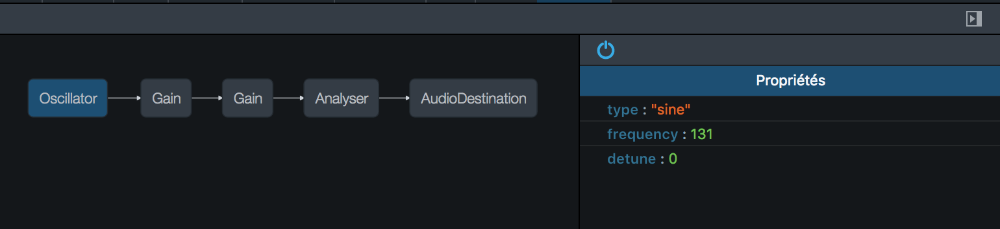
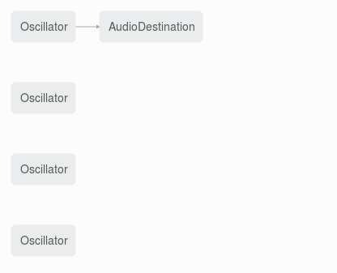

Dans cette course à l'armement du langage JavaScript, il ne faut pas oublier que des API sont aussi en train de se développer - ils en ont du boulot, les éditeurs de navigateurs ! Je vous laisse jeter un oeil à [la liste des API disponibles](https://developer.mozilla.org/fr/docs/Web/API). Ici, nous allons nous intéresser plus particulièrement à la partie des API; celle qui va enfin nous permettre de créer, modifier de la musique dans des pages web : La Web Audio API.

## Avant-propos

L'API étant relativement bas niveau, je pense qu'il est bon de reprendre un peu les bases de ce qu'est le son.

Voici la définition du son de Wikipédia:

> Le son est une vibration mécanique d'un fluide, qui se propage sous forme d'ondes longitudinales grâce à la déformation élastique de ce fluide. Les êtres humains, comme beaucoup d'animaux, ressentent cette vibration grâce au sens de l'ouïe.

Le son est donc une onde. C'est pour ça que les haut-parleurs font vibrer une membrane pour créer du son. Tout le monde se souvient de ses cours de seconde ? Ces cours nous disent qu'une onde est définie principalement par trois caractéristiques :

- L'amplitude : plus elle est élevée, plus le son sera perçu comme fort (On s'en sert pour régler le volume) ;
- La période : c'est l'intervalle de temps minimal entre deux états vibratoires identiques ;
- La fréquence : c'est l'inverse de la période (f = 1/t). Plus elle est élevée, plus le son est aigüe.

Avec la Web Audio API nous allons donc faire en sorte d'assembler en rythme plusieurs sons pour produire de la musique.

## L'histoire de l'audio dans le web

Avant de voir ce que l'API nous apporte, voyons ce que nous avions.

Les prémices du son dans des pages web date de 1995\. À l'époque, trois types de balises étaient disponibles : `bgsound`, `embed` et `applet`. Autant dire que les possibilités était assez restreintes et qu'un développeur utilisant une de ces balises aujourd'hui ferait perdre des cheveux à n'importe quel UX designer.

En 1997, le flash est apparu avec un _player_ et _Flash Media Server_, mais il n'existait toujours pas d'API native.

En 2008, c'est la révolution du HTML5 et l'intégration de la fameuse balise `<audio>`. Néanmoins, toujours pas moyen de produire directement du son.

Enfin, en 2010, le W3C définit la _Web Audio API_. À l'heure où j'écris ces lignes [le document est en _Editor's draft_](http://webaudio.github.io/web-audio-api/) mais [reste parfaitement utilisable sur tous les navigateurs, IE excepté](http://caniuse.com/#search=web%20audio%20api).

## OK, mais c'est quoi ?

L'API nous permet donc enfin d'avoir un contrôle total sur le son. Comment ? Grâce à un routing modulaire, c'est-à-dire que nous allons appliquer des nœuds audio à une source audio pour obtenir un son transformé en sortie. Un nœud audio peut par exemple correspondre à un filtre de certaines fréquences ou à un amplificateur, etc.

Comme le disait Napoléon, "un bon croquis vaut mieux qu'un long discours" et je pense que c'est en songeant au fameux empereur que les développeurs de Firefox ont développé un outil des plus pratiques pour visualiser les nœuds et leurs propriétés.



Dans cet exemple, nous apercevons donc différents nœuds et plus particulièrement les propriétés du nœud Analyser.

## Passons à la pratique !

Voici le Hello world sonore :

```javascript
let audioContext = new AudioContext();
let oscillator = audioContext.createOscillator();
oscillator.connect(audioContext.destination);
oscillator.start(audioContext.currentTime);
```

Après avoir créé un nouveau contexte audio, ce code crée un nœud de type oscillateur. Ce nœud, va nous permettre de créer du son, par défaut nous avons un oscillateur [sinusoïdal de 440Hz](https://fr.wikipedia.org/wiki/La440).

La troisième ligne connecte l'oscillateur à la destination du contexte audio. Concrètement, avant ces deux lignes, nous avions deux nœuds : l'oscillateur et la destination du contexte audio ; maintenant, la sortie de l'oscillateur est branchée à l'entrée du nœud de destination.

Enfin, la dernière ligne démarre l'oscillateur immédiatement.

### Attention avec le garbage collector

Les fuites de mémoire sont très faciles à obtenir avec l'API. En effet, si vous perdez la référence vers un nœud, il est impossible pour vous d'aller récupérer ce nœud. Par exemple, si vous exécutez le code de l'exemple au-dessus dans une fonction onClick d'un bouton, vous aurez à chaque clic un nouveau oscillateur de créé. Firefox vous montrera alors ce genre de graphiques :



Vous pouvez d'ailleurs tester la fuite de mémoire à [cette adresse](http://fberthelot.github.io/web-audio-api-examples/exemple1).

### L'API est en avance sur le temps

Vous aurez sans doute remarqué qu'il faut spécifier le temps actuel du contexte audio pour pouvoir démarrer l'oscillateur. Ce paramètre est envoyé pour la bonne raison que chaque nœud est en avance sur le temps du contexte audio. Pourquoi ? Tout simplement car un flux audio ne doit pas subir de ralentissement à cause des traitements JavaScript.

L'API met en place son propre système pour gérer le temps. Il faut donc faire très attention à ne pas utiliser des setInterval et setTimeout, il est important d'utiliser les événements et les Audio Params...

### ... les Audio Params

Nous avons vu que chaque nœud possède un ensemble de propriétés. Seulement, pour changer ces propriétés, nous devons faire attention au timing selon lequel nous allons les changer.

Pour cela, chaque nœud possède un ensemble de fonctions qui permettent de planifier le changement de chacun de leurs attributs. Par exemple pour augmenter progressivement la fréquence de notre précédent oscillateur, il faut faire :

```javascript
// Va augmenter la fréquence de 440Hz à 456Hz linéairement pendant 10 secondes
oscillator.frequency.linearRampToValueAtTime(456, audioContext.currentTime + 10);
```

Il existe de nombreuses méthodes pour changer les attributs : [setValueAtTime](https://developer.mozilla.org/en-US/docs/Web/API/AudioParam/setValueAtTime), [linearRampToValueAtTime](https://developer.mozilla.org/en-US/docs/Web/API/AudioParam/linearRampToValueAtTime), [exponentialRampToValueAtTime](https://developer.mozilla.org/en-US/docs/Web/API/AudioParam/exponentialRampToValueAtTime), [setTargetAtTime](https://developer.mozilla.org/en-US/docs/Web/API/AudioParam/setTargetAtTime), [setValueCurveAtTime](https://developer.mozilla.org/en-US/docs/Web/API/AudioParam/setValueCurveAtTime) et [cancelScheduledValues](https://developer.mozilla.org/en-US/docs/Web/API/AudioParam/cancelScheduledValues).

### Les différents types de nœuds

Nous n'avons vu jusqu'ici que deux types de nœuds. Il en existe cependant plein d'autres :

- [GainNode](https://developer.mozilla.org/fr/docs/Web/API/GainNode) : ces nœuds servent à amplifier ou diminuer le signal. Concrètement, ils servent à contrôler le son ;
- [Delay](http://webaudio.github.io/web-audio-api/#the-delaynode-interface), ce type de nœud ralentit l'entrée avant de la propager à la sortie. Ils peuvent servir à créer un écho ;
- [BiquadFilterNode](https://developer.mozilla.org/en-US/docs/Web/API/BiquadFilterNode) : type de nœud qui crée un filtre audio. Pour plus d'informations sur les filtres, [vous pouvez aller voir sur Wikipédia](https://fr.wikipedia.org/wiki/Filtre_%28audio%29#Filtres_passe-haut_et_passe-bas) ;
- [PannerNode](https://developer.mozilla.org/fr/docs/Web/API/AudioListener) : permet de spatialiser le son. Il est effectivement d'ores et déjà possible de faire un bon jeu de tir en JS avec un son 3D pour permettre aux joueurs de savoir d'où viennent les coups de feu !
- [Convolver](http://webaudio.github.io/web-audio-api/#linear-effects-using-convolution) : généralement utilisés pour faire de la réverbération, ils servent à reproduire l'ambiance d'une pièce ;
- [SplitterNode](http://webaudio.github.io/web-audio-api/#the-channelsplitternode-interface) : sert à séparer les différentes pistes d'une source audio, par exemple à partir d'une source stéréo on obtient en sortie deux sources : la droite et la gauche ;
- [MergerNode](http://webaudio.github.io/web-audio-api/#the-channelmergernode-interface) : fait exactement le contraire du nœud précédent ;
- [Waveshaper](https://developer.mozilla.org/fr/docs/Web/API/WaveShaperNode) : applique une distorsion aux signaux. Amis guitaristes, cet effet est pour vous !
- [Compressor](http://webaudio.github.io/web-audio-api/#the-dynamicscompressornode-interface) : permet de réduire le volume des parties les plus fortes et d'augmenter celui de celles qui le sont moins ;

- [AnalyserNode](https://developer.mozilla.org/fr/docs/Web/API/AnalyserNode) : nœud d'analyse il permet d'accéder en temps réel aux données du son. Il renvoie en sortie ce qu'il a exactement en entrée. Pratique pour faire un oscilloscope !

- [AudioBufferSourceNode](https://developer.mozilla.org/fr/docs/Web/API/AudioBufferSourceNode) : nœud représentant une source audio (NB : type de nœud qui n'a aucune entrée, comme l'oscillateur). À utiliser uniquement pour les sons courts (inférieurs à une minute) ;

- [MediaElementAudioSourceNode](https://developer.mozilla.org/fr/docs/Web/API/MediaElementAudioSourceNode) : comme le précédent il représente une source audio mais doit servir pour les sons longs. La source audio provient des balises `<audio>` et `<video>`.

## Conclusion

Bien que les spécifications W3C ne soient pas entièrement figées, la Web Audio API est d'ores et déjà très complète et implémentée dans les navigateurs récents comme sur les terminaux mobiles. Il est même dès à présent possible de faire des logiciels complexes de retouche audio en application web. [Dans le prochaine article, nous verrons ce que sont les web audio worker](../les-audio-worker).
